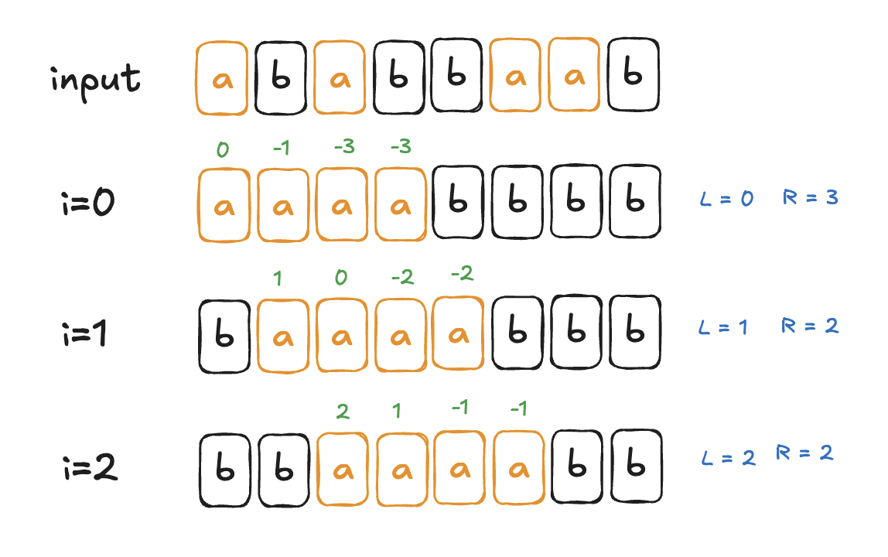

---
title: Codeforces Round 1054 (Div. 3)
categories: Codeforces
tags: codeforces cf_summary
article_header:
  type: cover
---
## Contest info

[> Go to Codeforces Contests list](../codeforces)

| Title | <a href="https://codeforces.com/contest/2149">Codeforces Round 1054</a> |
| Division | Div. 3 |
| Date | 2025 / 09 / 25 |
| Official | Unrated |
| Rank | 2610 |
| Performance | <strong><span style="color:#000000">N/A</span></strong> |
| Rating | <strong><span style="color:#000000">N/A</span></strong>  <span style="color:#777777">(N/A)</span> |

## Problems

| <strong>#</strong> | <strong>Name</strong> | <strong> Solved </strong> | <strong>Attempt</strong> |
| :---: | --- | :---: | :---: |

| A | Be Positive | <span style="color:green"> solved </span> | 0 |
| B | Unconventional Pairs | <span style="color:green"> solved </span> | 0 |
| C | MEX rose | <span style="color:green"> solved </span> | 0 |
| D | A and B | <span style="color:green"> solved </span> | 1 |
| E | Hidden Knowledge of the Ancients |  | 0 |
| F | Nezuko in the Clearing | <span style="color:green"> solved </span> | 0 |
| G | Buratsuta 3 |  | 0 |


## Solution

### A. Be Positive
#### 요약
작업: 배열의 요소 하나 +1
배열의 요소를 모두 곱한 결과를 0보다 큰 정수로 만드는 최소 작업 수

##### 제한
테스트케이스 $t$ ($1 \leq t \leq 10^4$)
array 길이 $n$ ($1 \leq n \leq 8$)
array 요소 $a_i$ ($-1 \leq a_i \leq 1$)

#### 풀이
0일 경우: 곱하면 무조건 0이기때문에 +1
-1일 경우: -1이 홀수개이면 +2
[Code](https://codeforces.com/contest/2149/submission/340373751)

### B. Unconventional Pairs
#### 요약
$n$개의 정수를 가진 배열 ($n$은 짝수)
배열의 요소를 2개씩 짝지어서 $\frac{n}{2}$개의 pair을 만듦
각 pair 요소들의 차이 $|x-y|$의 최댓값을 최소화 할때 결과값
max($|a_p_i - a_q_i|$)를 최소화

##### 제한
테스트케이스 $t$ ($1 \leq t \leq 10^4$)
array 길이 $n$ ($2 \leq n \leq 2\cdot 10^5$, $n$ 짝수)
array 요소 $a_i$ ($-10^9 \leq a_i \leq 10^9$)

모든 테스트케이스의 $n$ 합은 $2\cdot 10^5$ 을 넘지 않음

#### 풀이
배열 sort후 순서대로 매칭
가장 큰 결과 출력
[Code](https://codeforces.com/contest/2149/submission/340381287)

### C. MEX rose
#### 요약
$MEX(a)$: 배열 $a$에서 나타나지 않은 **0을 포함한 양의 정수** 중 **가장 작은것**

길이 n짜리 배열 a와 k가 주어짐

작업: Index $i (1 \leq i \leq n)$를 골라 $a_i$를 $[0, n]$ 범위 중 원하는 숫자로 바꿈

$MEX(a) = k$를 만드는 최소한의 작업 수 

##### 제한
테스트케이스 $t$ ($1 \leq t \leq 10^4$)
array 길이 $n$ ($2 \leq n \leq 2\cdot 10^5$)
목표 $k$ ($0 \leq k \leq n$)
array 요소 $a_i$ ($-10^9 \leq a_i \leq 10^9$)

모든 테스트케이스의 $n$ 합은 $2\cdot 10^5$ 을 넘지 않음

#### 풀이
$0~k-1$까지 존재하고 $k$는 없어야함
$0~k-1$까지 채우는 작업과 $k$를 없애는 작업 2가지로 나눔
$k$를 $0~k-1$로 바꾸면 한번에 두개의 작업 가능
max($0~k-1$까지 비어있는 수, $k$갯수)
[Code](https://codeforces.com/contest/2149/submission/340399175)


### D. A and B
#### 요약
길이$n$의 'a'와 'b'로 이루어진 문자열 $s$

작업: $i (1 \leq i \leq n-1)$를 골라 $s_i$와 $s_{i+1}$을 swap
$s_1$과 $s_{n}$이 연결되어 있을 때 (원순열느낌) a와 b를 각각 한 블럭에 위치하도록 만들어라 

가능한 문자열:
- 'aaabbbaaa'
- 'bbbaaaaaabbb' 
- 'aaaaabbbb' or 'bbbbaaaaa'

##### 제한
테스트케이스 $t$ ($1 \leq t \leq 10^4$)
문자열 길이 $n$ ($1 \leq n \leq 2\cdot 10^5$)
문자열 $s$의 요소 ['a', 'b']

모든 테스트케이스의 $n$ 합은 $2\cdot 10^5$ 을 넘지 않음

#### 풀이
a또는 b중 하나는 무조건 배열에서 연속으로 존재해야함
a또는 b에 대하여 각각 해당 요소가 포함된 배열이 $i$부터 연속해서 존재할 때 이동 횟수를 구해서 최솟값 출력

이동횟수는 다음과 같은 규칙을 띔. 배열의 요소의 위치의 차 만큼 cost합이 낮아지거나 높아짐


i는 0부터 점점 커지니까 원래 배열의 요소가 현재 배열의 요소보다 왼쪽에 있을 경우 cost는 늘어나며 오른쪽에 있을 경우 줄어듦

i가 0일때 위치를 기준으로 위치 차이 계산 
pq로 관리하면서 위치의 차이가 0이 되는 순간 해당 요소의 위치를 지나가기 때문에 왼쪽카운트를 늘려줌

현재 배열의 cost = 이전배열의 cost + lcnt - rcnt;

[Code](https://codeforces.com/contest/2149/submission/340469193)

### E. Hidden Knowledge of the Ancients
#### 요약
길이 $n$짜리 배열 $a$가 주어짐.
배열 $a$의 부분배열 중 길이가 $l$이상 $r$이하 이면서 정확히 $k$개의 서로 다른 숫자가 존재하는 부분배열의 갯수를 구해라

##### 제한
테스트케이스 $t$ ($1 \leq t \leq 10^4$)
배열길이 $n$ ($1 \leq n \leq 2 \cdot 10^5$)
배열요소 $a_i$ ($1 \leq a_i \leq 10^9$)
서로다른 숫자의 갯수 $k$ ($1 \leq k \leq n$)
부분배열의 최소/최대 길이 $l, r$ ($l \leq c-b+1 \leq r$)

모든 테스트케이스의 $n$ 합은 $2\cdot 10^5$ 을 넘지 않음

#### 풀이


### F. Nezuko in the Clearing
#### 요약
위치 $0$에서 체력 $h$로 $d$까지 도달하려고 함.

한턴에 다음과 같은 작업 수행 가능
- 휴식하고 체력+1
- 현재 위치 x에서 x+1로 이동

$j$번 연속 이동할 때 마다 체력을 $j$만큼 소모 (휴식할 시 초기화)

$d$에 도달하는 최소 턴 구하기

##### 제한
테스트케이스 $t$ ($1 \leq t \leq 10^4$)
시작 체력 $h$ ($1 \leq h \leq 10^9$)
도착 위치 $d$ ($1 \leq d \leq 10^9$)

#### 풀이
최소 턴: $d$ (한번도 안쉬고 이동)
최대 턴: $2d$ (쉬고 이동 반복)
$[d, 2d]$ 이분탐색

현재 턴이 $z$일 때, 사용 가능한 체력은 $h+(z-d)$
체력을 최소한으로 쓰려면 최대 연속 이동횟수를 최소화 (휴식 간격을 공평하게)
해당 조건으로 가능 여부 판별 후 이분탐색
```
acost = d/(z-d+1); //기본 최대 비용
ret = (acost+1) * (d%(z-d+1)); //나머지가 있을경우 나머지비용 추가
ret += (acost*(acost+1))/2*(z-d+1); //구간 비용 합
```


[Code](https://codeforces.com/contest/2149/submission/340495300)